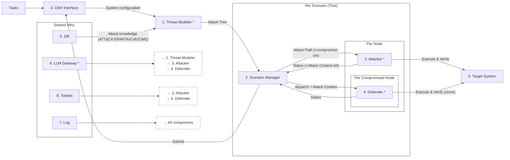
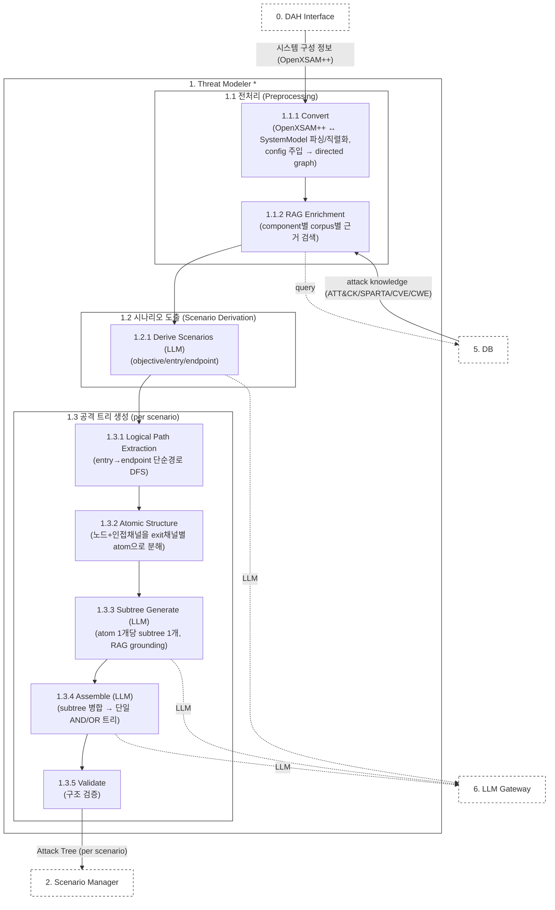
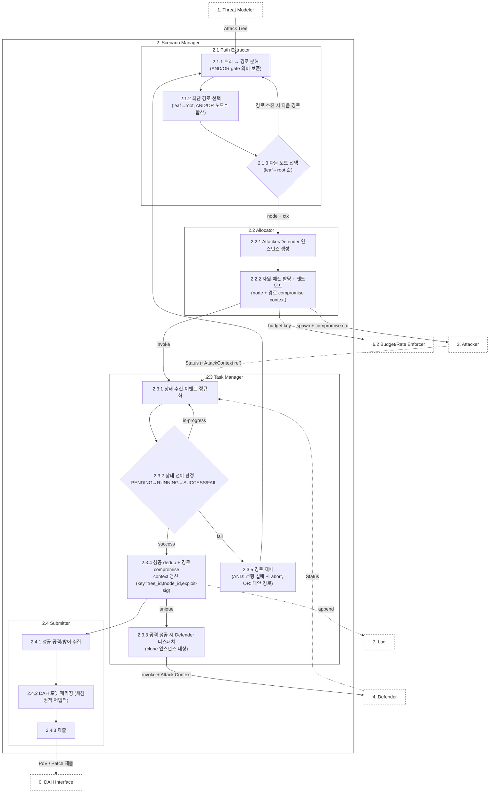
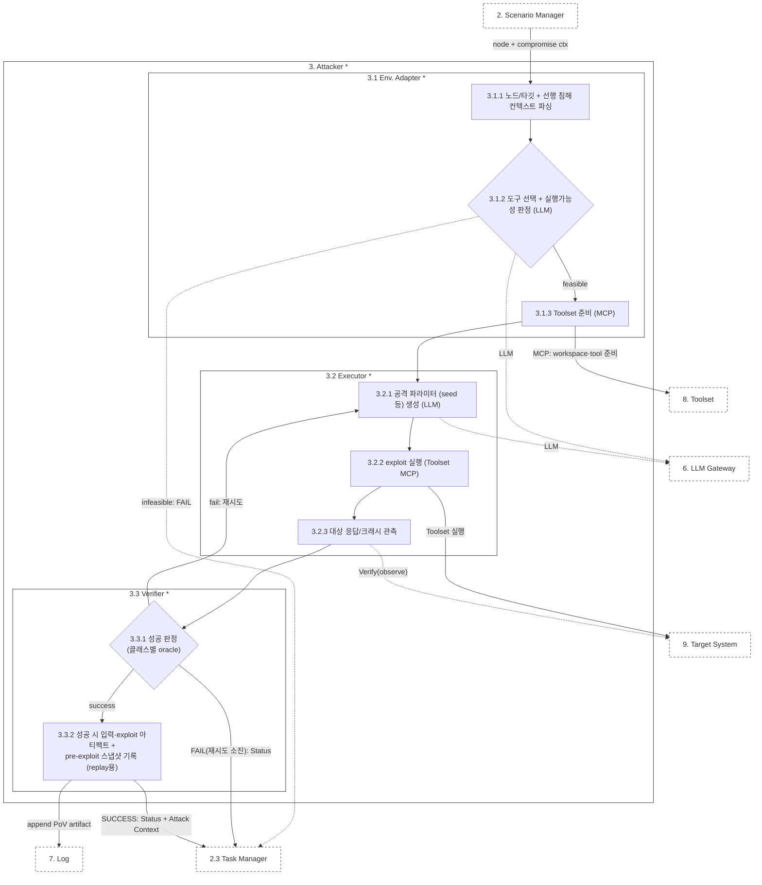
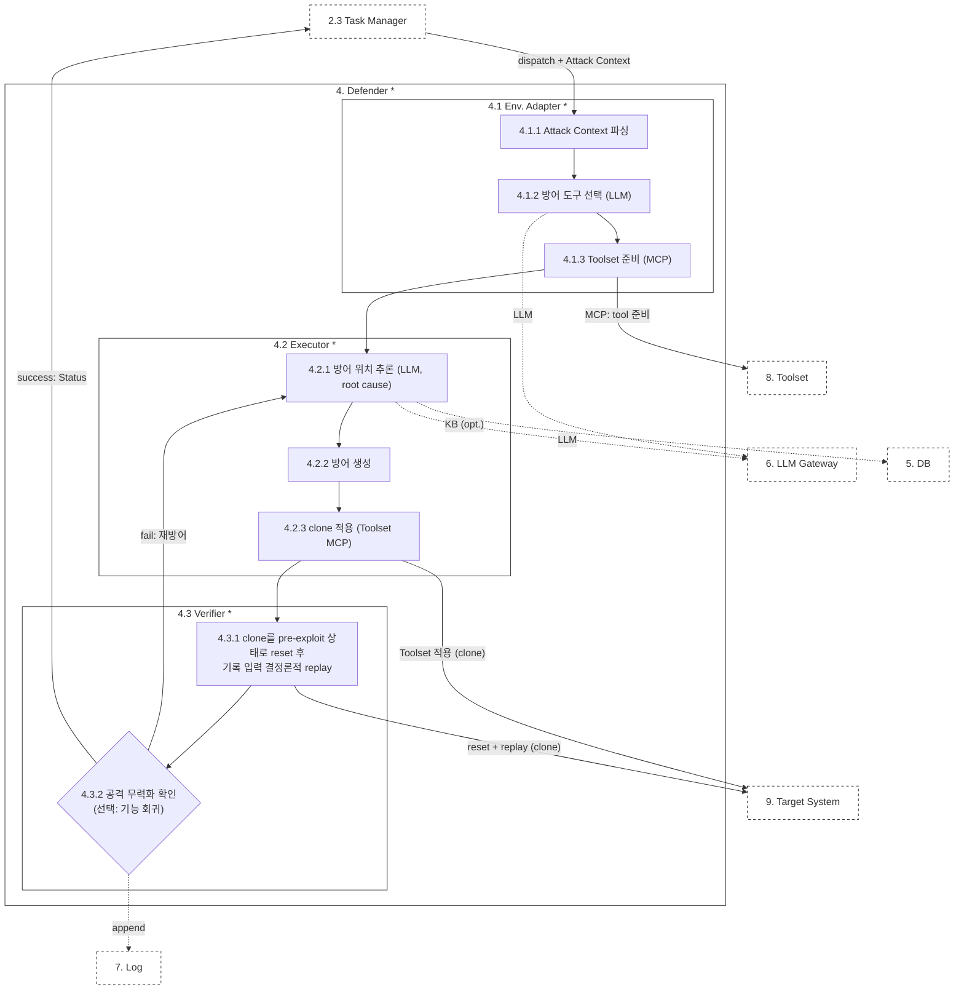
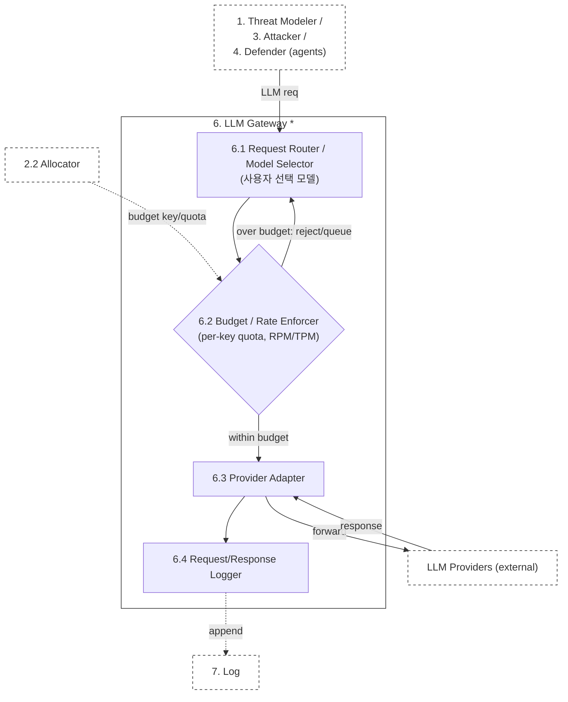

# SANITY: 아키텍쳐 명세서

> 본 문서는 SANITY의 아키텍쳐 명세서로 최대한 본선용 시스템으로 확장 가능성을 열어두고 작성되었으며, 실제 예선 보고서 작성용으로 구현 시 그 구현 사항이 더 구체적이고, 스코프가 정해질것이라 예상됨 (제한된 tool이나 제한된 input 및 testbed 등). 명세서는 전체 Context Diagram -> 개별 component 순이며, 각 component별 역할에 대해 설명함.
>
> **v4 개정.** (1) Attacker→Defender 직접 엣지 제거 — AttackContext는 Status와 함께 2.3으로, dispatch는 2.3.3에서 Defender로 라우팅(Fig1/Fig4/Fig5·§9). (2) 트리 노드에 결정론적 `tnode_id`(루트 기준 구조적 경로) 및 `tree_id`(트리 정규직렬화 해시)를 SM 수신 시점에 부여해 개별 식별 확보(§4). (3) Toolset을 host-CLI 실행계약·KIND_ENUM 14종(network_scanner/network_attacker/config_hardener/ids_rule_validator 포함)으로 명시(§8). (4) LLM 예산키 구성과 wall-clock 강제 주체(Gateway 미강제, Allocator 강제)를 명확화(§7).
>

---

## 1. Overview

목표: 대상 무인체계 정보를 입력받아 (i) 위협모델링을 수행하여 개별 공격 시나리오별 공격 트리를 도출, (ii) 경로별 자율 에이전트가 공격 수행·검증, (iii) 성공 공격에 대해 방어 생성·검증, (iv) 결과 제출. 대상 시스템은 클라우드에 배포된 **라이브 시뮬레이터(Damn Vulnerable Drone, ArduPilot SITL/MAVLink)**이며, SANITY와 대상을 동일 클라우드에 배치해 실제 공격·방어를 수행한다.

구성: 큼직한 구조는 다음과 같음

- **위협모델링 모듈(1)**: DefenseWeaver를 차용하여 위험도 분석 부분을 제외한 시나리오별 공격 트리 생성. 시나리오·서브트리·조립은 LLM으로 생성하며, 각 component는 DB(5)의 RAG(ATT&CK/SPARTA/CVE/CWE)로 grounding한다.
- **시나리오 관리자 모듈(2)**: 단일 공격 트리(공격자의 최종 목표를 달성하기 위한 경로의 집합)를 AIxCC의 CP(해결해야 하는 문제)로 보고, ATLANTIS의 CP Manager의 워크플로우를 참고하여 구성. 생성되는 트리별로 인스턴스화.
- **공격·방어 모듈(3,4)**: 트리의 각 노드 단위로 인스턴스화. 노드 분석 및 공격·방어에 필요한 도구부터 공격 수행, 검증까지 독립적으로 수행.
- **공용 인프라(0, 5~9)**: DB, 로그, toolset 등 SANITY의 내부 구성 요소들이 공통적으로 사용하는 구성품 집합.

---

## 2. Context Architecture

*Figure 1. SANITY Context Diagram.*

Context Diagram의 최상위 구성 요소 역할:

- **0. DAH Interface**: 대회 서버와 SANITY의 경계. 대상 시스템 정보를 수신해 Threat Modeler(1)로 relay하고, Scenario Manager(2)의 제출을 대회 서버로 중계한다.
- **1. Threat Modeler***: 시스템 구성 정보를 입력받고 DB(5)의 attack knowledge(ATT&CK/SPARTA/CVE/CWE)로 component를 grounding한 뒤, LLM으로 시나리오를 도출하고 시나리오별 공격 트리를 생성한다(§3).
- **2. Scenario Manager**: 공격 트리를 실행 단위로 분해하고 공격·방어 에이전트를 오케스트레이션하는 트리 수준 제어 평면(§4). 트리당 1 인스턴스.
- **3. Attacker***: 할당된 노드에 대해 도구 선택·실행가능성 판정·exploit 수행·검증을 독립 수행한다(§5). 노드당 1 인스턴스.
- **4. Defender***: Task Manager(2.3.3)가 dispatch·주입한 성공 공격 정보(Attack Context)를 받아 방어를 생성·검증한다(§6). Attacker가 직접 호출하지 않는다. 침해 노드당 1 인스턴스.
- **5. DB**: UxV 관련 지식 베이스. 위협모델링 RAG의 지식원(§8).
- **6. LLM Gateway***: LLM 에이전트(1,3,4)의 공통 LLM enabler(§7).
- **7. Log**: CRS 전반의 이벤트를 append-only로 기록(§8).
- **8. Toolset**: 도구 서술자(실행계약)·실행기·증거 레지스트리. 에이전트는 MCP로 도구 실행을 위임하고 Toolset이 실행·증거기록한다(§8).
- **9. Target System**: 클라우드에 배포된 라이브 대상(예선: Damn Vulnerable Drone = ArduPilot SITL/MAVLink). 실제 공격·방어를 수행하며 역할별 인스턴스(공격용 원본 / 방어검증용 clone)를 지원한다(§8).

---

## 3. Threat Modeler\* (1)

**역할.** DAH Interface(0)의 시스템 구성 정보를 입력받아 OpenXSAM++ 기반 directed graph로 구성하고, DB(5)의 attack knowledge(RAG)로 각 component를 grounding한 뒤, LLM으로 시나리오를 도출하고 시나리오별 AND/OR 공격 트리를 생성·검증한다.

**참고** 예선에서는 DFD 형식의 시스템 모델 + 개별 DFD 요소별 configuration 정보를 기본적으로 제공. 본선 진출 시 제공되는 interface에 맞게 converter 별도 구현이 필요하다.

*Figure 2. Threat Modeler 내부 동작 절차.*

- **1.1 전처리 (Preprocessing)**: 시스템 구성 정보를 directed graph로 구성하고 각 component에 근거를 부착하는 단계.
- **1.1.1 Convert**: DAH Interface(0)가 전달한 OpenXSAM++ 문서를 파싱해 SystemModel(노드/채널) + config로 복원하고, config를 주입해 LLM 단계가 추론할 directed graph를 구성한다.
- **1.1.2 RAG Enrichment**: 각 component를 corpus별(mitre_attack_enterprise, mitre_attack_ics, sparta, cve, cwe)로 **개별 질의**해 TTP/CVE/CWE 근거(evidence id + summary)를 수집한다. 서버 장애·무응답 시 해당 component는 근거 없이 진행하며(fail-closed) 결과를 조작하지 않는다. (`stages.rag_enrich_components`, `attack_rag`)
- **1.2 시나리오 도출 (Scenario Derivation)**: grounding된 그래프로부터 공격 시나리오를 생성하는 단계.
- **1.2.1 Derive Scenarios (LLM)**: 그래프 + RAG 컨텍스트를 입력으로 LLM이 시나리오(objective, 1개 이상 entry, 정확히 1개 endpoint)를 도출한다. 모델이 반환한 라벨/대소문자 변형 id는 실제 node id로 관대하게 resolve하고 resolve 불가한 시나리오는 drop한다. (`stages.derive_scenarios`)
- **1.3 공격 트리 생성 (Attack Tree Generation, 시나리오별 반복)**: 시나리오마다 경로·atom·서브트리를 거쳐 트리로 조립·검증하는 단계.
- **1.3.1 Logical Path Extraction**: 그래프에서 시나리오의 entry→endpoint 단순(비순환) 경로를 DFS로 전수 열거한다. 순수 결정론적이며 LLM을 쓰지 않고, `max_len`/`max_paths` 캡으로 경로 폭발을 방지한다. (`graph.all_simple_paths`/`scenario_paths`)
- **1.3.2 Atomic Structure**: 경로 상 각 노드를 atom(노드 + 인접 채널)으로 분해하되 exit 채널별로 분할해 atom마다 국소 목표 1개를 갖게 하고, endpoint 노드는 exit 없는 terminal atom을 추가로 생성한다. (`graph.build_atoms`)
- **1.3.3 Subtree Generate (LLM)**: atom 1개당 subtree 1개를 생성한다(다수 atom을 묶지 않음). 각 subtree는 해당 component의 RAG 근거로 grounding된 균일(AND/OR) 노드 트리다. (`stages.construct_subtree`)
- **1.3.4 Assemble (LLM)**: subtree들을 시나리오 목표를 root로 하는 단일 AND/OR 균일 노드 트리로 병합한다(SEQ 노드 없음, 순서는 부모/자식 중첩으로 표현). (`stages.assemble`)
- **1.3.5 Validate**: 조립된 트리를 구조적으로 검증한다(§3.1). 결과는 이슈 목록으로 로그에만 남기며 트리를 재생성하지 않는다. (`validator.validate_attack_tree`)

---

## 4. Scenario Manager (2)

**역할.** 공격 트리(단일 root 목표)를 실행 단위로 분해하고 공격·방어 에이전트를 오케스트레이션하는 트리 수준 제어 평면.

*Figure 3. Scenario Manager 내부 동작 절차.*

- **2.1 Path Extractor**: 공격 트리를 실행 가능한 경로 단위로 분해하고 다음 공격 대상 노드를 선택하는 하위 모듈.
- **2.1.1 트리 → 경로 분해**: 입력 공격 트리를 root-to-leaf 선형 경로 집합으로 분해한다. AND 게이트는 자식마다 접두부를 공유하는 복수 경로를, OR 게이트는 자식마다 대안 경로를 생성하며, 각 노드의 gate 종류를 경로에 보존한다. TM 출력 트리의 노드는 익명 중첩 객체이므로(설계요구사항 DM-2), 이 시점에 각 노드에 **결정론적 `tnode_id`**(루트 기준 구조적 경로 인덱스; DAG/memoize 모드에서는 노드 정규내용 해시)를 부여해 개별 식별을 확보하고, **`tree_id`**(트리 정규직렬화 해시)를 SM 인스턴스화 시 1회 부여·State Store에 영속화한다. 이 식별자가 dedup 키·CompromiseContext·PoV의 노드 참조 정본이며, 동일 트리·노드는 재실행·재시작에도 동일 식별자를 산출한다(설계요구사항 INV-4).
- **2.1.2 최단 경로 선택**: 트리의 root-to-leaf 경로 후보 중, leaf에서 root까지 도달에 필요한 총 노드 수(AND 게이트는 필수 자식을 모두 합산, OR 게이트는 최소 비용 대안 1개만 합산)가 가장 작은 경로를 선택한다.
- **2.1.3 다음 노드 선택**: 선택된 최단 경로에서 leaf(최말단, 구체 실행 가능 공격)부터 root(최종 목표) 방향으로 다음 공격 노드를 선택한다. 실행가능성 판정은 하지 않고 Attacker(3.1)로 위임하며, 경로 소진 시 다음 경로로 이동한다.
- **2.2 Allocator**: 에이전트 인스턴스 생성과 자원·예산 할당, Target clone 생명주기를 담당하는 하위 모듈.
- **2.2.1 Attacker/Defender 인스턴스 생성**: 선택된 노드마다 Attacker 인스턴스를 생성한다. Defender 인스턴스는 즉시 생성하지 않고, Task Manager(2.3.3)의 요청 시점에 clone과 함께 생성한다.
- **2.2.2 자원·예산 할당 + 핸드오프**: per-agent 예산(LLM 토큰·wall-clock)을 산정해 Gateway(6.2)에 키/쿼터로 발급하고, Attacker에 노드 정보 + 경로 compromise context(선행 침해 상태)를 함께 전달한다.
- **2.3 Task Manager**: 에이전트 상태를 추적하고 디스패치·dedup·경로 제어를 수행하는 하위 모듈.
- **2.3.1 상태 수신·이벤트 정규화**: Attacker/Defender가 방출한 상태 이벤트를 수신해 공통 스키마로 정규화하고 State Store에 반영한다.
- **2.3.2 상태 전이 판정**: 인스턴스 상태를 PENDING→RUNNING→SUCCESS/FAIL로 전이 판정하고, 결과에 따라 후속 분기(성공: dedup→디스패치, 실패: 경로제어)를 결정한다.
- **2.3.3 공격 성공 시 Defender 디스패치**: 공격이 성공하면 Task Manager가 단독 권한으로 Allocator에 Defender+clone 생성을 요청하고 Attack Context를 주입한다(Attacker가 직접 호출하지 않음).
- **2.3.4 성공 dedup + 경로 compromise context 갱신**: 성공을 `(tree_id, tnode_id, exploit-signature)` 키로 중복 제거하고(2.1.1에서 부여한 식별자 사용), 경로 compromise context에 획득 foothold를 추가한다. 또한 leaf 성공을 트리 상방으로 전파해 각 내부 노드의 AND/OR 충족과 root 목표 달성을 판정한다. dedup은 Defender 디스패치(2.3.3)의 게이트로 선행한다(중복이면 디스패치 생략).
- **2.3.5 경로 제어**: 공격 FAIL(재시도 상한/예산 소진) 시 AND 필수 노드면 해당 경로를 abort하고 OR면 대안 경로로 전환한다(2.1로 회귀).
- **2.4 Submitter**: 성공 결과를 수집·패키징·제출하는 하위 모듈.
- **2.4.1 성공 공격/방어 수집**: dedup을 통과한 성공 PoV/Patch 아티팩트를 수집한다.
- **2.4.2 DAH 포맷 패키징**: 수집 아티팩트를 제출 번들로 패키징하며, 채점 규칙 종속 부분은 채점정책 어댑터로 격리한다.
- **2.4.3 제출**: 번들을 제출한다(예선: 로컬 sink 저장, 본선: DAH API).

---

## 5. Attacker\* (3)

**역할.** 할당된 노드에 대해 도구 선택·실행가능성 판정·exploit 수행·검증. 주어진 도구로 공격이 불가하면 실패로 간주해 Scenario Manager(2.3)로 통보한다.

*Figure 4. Attacker 내부 동작 절차.*

- **3.1 Env. Adapter***: 노드/컨텍스트를 해석하고, 공격 도구를 선택·실행가능성 판정하며 Toolset(8) MCP로 준비하는 하위 모듈.
- **3.1.1 노드/타깃 + 선행 침해 컨텍스트 파싱**: 입력된 노드 정보와 경로 compromise context를 파싱해 공격 표면(프로토콜·인터페이스·진입점)과 선행 침해로 확보된 foothold를 식별한다.
- **3.1.2 도구 선택 + 실행가능성 판정**: Toolset(8)의 inventory를 검사하여 이 노드의 공격이 실행 가능한지 판정하고, 어떤 가용 도구로도 불가하면 해당 공격을 실패(FAIL)로 간주해 Status를 Task Manager(2.3)로 통보하고 Executor(3.2)로 진행하지 않는다.
- **3.1.3 Toolset 준비 (MCP)**: (실행 가능 판정 시) Toolset(8) MCP로 workspace를 확보하고 선택 도구를 준비한다. 도구 실행·evidence 기록은 Toolset이 담당하며(에이전트가 이미지를 받아 직접 실행하지 않음), 에이전트는 artifact_ref만 받는다.
- **3.2 Executor***: 공격에 필요한 seed 등 파라미터 생성과 도구 호출로 실제 exploit을 실행·관측하는 하위 모듈.
- **3.2.1 공격 파라미터 생성**: LLM으로 노드 정보·프로토콜에 grounding한 공격 입력(seed 등)을 생성한다(Gateway 경유). 실행부 재현성 확보를 위해 LLM 역할은 입력값 생성으로 국한한다.
- **3.2.2 exploit 실행 (Toolset MCP)**: exploit 직전 pre-exploit 스냅샷(또는 replay-prefix)을 캡처한 뒤, Toolset MCP(build/start_fuzz/run_tool/reproduce_pov 등)로 도구를 실행해 대상에 입력을 주입한다.
- **3.2.3 대상 응답/크래시 관측**: 주입 결과로 발생한 대상의 응답·크래시·행위/텔레메트리 상태 변화를 관측한다.
- **3.3 Verifier***: 공격 성공을 판정하고 재검증용 아티팩트를 기록하는 하위 모듈.
- **3.3.1 성공 판정**: 성공을 대상이 위조할 수 없는 외부 관측치로 판정하되 **관측 수단은 공격 클래스에 따른다**(클래스는 3.1의 선택 도구 종류로 결정): (i) 메모리/crash(퍼저·sanitizer로 ArduPilot SITL·서비스 공략) → sanitizer 리포트/프로세스 종료코드/무응답(DoS); (ii) 로직/프로토콜(MAVLink 주입·GPS 스푸핑 등) → 텔레메트리/행위 상태 변화(arm·mode·위치)·auth 상태. 대상 자기보고는 신뢰하지 않는다.
- **3.3.2 성공 시 아티팩트 기록**: 성공 시 성공 입력·exploit 아티팩트와 (3.2.2에서 캡처한) pre-exploit 스냅샷 참조를 PoV로 기록하고, Attack Context를 status와 함께 Task Manager(2.3)로 방출한다. 실패 시 3.2로 재시도한다.

---

## 6. Defender\* (4)

**역할.** Attack Context를 읽고 방어 도구를 선택·적용·검증. 공격 파이프라인 간섭을 막기 위해 격리 clone 인스턴스에서 동작한다.

*Figure 5. Defender 내부 동작 절차.*

- **4.1 Env. Adapter***: 공격 정보를 해석하고 방어 도구를 선택·확보하는 하위 모듈.
- **4.1.1 Attack Context 파싱**: Task Manager(2.3.3)가 dispatch 시 주입한 Attack Context를 파싱해 exploit 유형·영향 노드(tnode_id)·PoV 정보를 식별한다. Attacker로부터 직접 수신하지 않는다.
- **4.1.2 방어 도구 선택**: PoV.effect(공격 클래스)에 따라 방어 수단을 선택한다 — crash 클래스=소스 패치+재빌드(ArduPilot 소스 가용), 로직/프로토콜 클래스=config 하드닝·MAVLink 서명·파라미터 강화·IDS/차단.
- **4.1.3 Toolset 준비 (MCP)**: 선택된 방어 도구를 Toolset(8) MCP로 준비한다(에이전트 직접 실행 아님).
- **4.2 Executor***: 패치 등 방어 위치를 추론하고 방어를 생성·적용하는 하위 모듈.
- **4.2.1 방어 위치 추론**: crash 클래스는 LLM으로 root cause 위치를 추론한다(입력: PoV 크래시 정보·대상 소스, 선택 KB(5)). 로직/프로토콜 클래스는 위치 추론 대신 정책 대상(파라미터·서명·필터 규칙)을 식별한다.
- **4.2.2 방어 생성**: 추론된 위치에 대한 패치(unified diff) 등 방어 조치를 생성한다.
- **4.2.3 격리 clone에 적용 (Toolset MCP)**: 생성된 방어를 Allocator 발급 격리 clone에 Toolset MCP로 적용한다 — crash=patched-build 재빌드, 로직=config/서명/규칙 적용. 원본은 무방어로 유지해 downstream 도달성을 보존한다(PoV-build vs patched-build 분리와 동일).
- **4.3 Verifier***: 방어의 공격 무력화와 기능 회귀를 검증하는 하위 모듈.
- **4.3.1 clone reset + replay**: clone을 pre-exploit 상태로 reset한 뒤 동일 공격을 재현한다 — crash 클래스=기록 입력(input_blob) 결정론적 replay, 로직 클래스=상태 reset 후 공격 시퀀스(MAVLink 주입 등) 재현(공격 입력 재생성이 아님).
- **4.3.2 공격 무력화 확인**: replay 공격이 무력화됨(a) 그리고 기능 회귀 없음(b, 시뮬레이션 정상 미션 시나리오 통과)을 함께 확인한다. 무력화(a) 판정은 3.3.1과 같은 클래스별 oracle로 한다(crash=공격 비재현/신규 sanitizer finding 없음, 로직=주입 거부·텔레메트리 정상). (a)만 만족하면 방어 무효로 처리해 4.2로 재방어한다. 성공 시 Defend+status를 2.3으로 방출한다.

---

## 7. LLM Gateway\* (6)

**역할.** LLM 에이전트(1,3,4) 공통 enabler. 라우팅·모델선택, 예산·레이트 강제, 프로바이더 연동, 로깅.

*Figure 6. LLM Gateway 내부 동작 절차.*

- **6.1 Request Router / Model Selector**: 에이전트(1,3,4)의 LLM 요청을 수신해 사용자 선택 모델(Claude 계열)로 라우팅한다.
- **6.2 Budget / Rate Enforcer**: Allocator(2.2)가 발급한 per-key 쿼터(설계요구사항 DM-11 BudgetGrant: `token_budget`·`rpm_limit`·`tpm_limit` 등)에 근거해 예산·레이트(RPM/TPM)를 강제한다. 초과 요청은 거부하거나 큐잉한다. 키에 `wall_clock_s`가 실려도 Gateway는 이를 강제하지 않으며(아래 참조), Allocator의 per-agent 시한이 강제한다.
- **6.3 Provider Adapter**: 승인된 요청을 외부 LLM 프로바이더로 전달하고 응답을 회수한다.
- **6.4 Request/Response Logger**: 모든 요청/응답을 Log(7)에 append한다(키·비밀 마스킹).

예산의 결정(2.2)과 강제(6.2)를 분리한다. Gateway가 모든 요청의 단일 통과 지점이므로 유일한 강제 지점으로 타당하다. 단, Gateway는 **LLM 예산(토큰·RPM/TPM)만** 강제한다 — 도구 실행의 compute·wall-clock은 Gateway를 지나지 않으므로 Allocator(2.2)의 per-agent 시한과 Toolset per-tool timeout이 강제한다.

---

## 8. Supporting Components (0, 5, 7, 8, 9)

- **0. DAH Interface**: 예선은 시스템 구성 정보를 relay(변환은 1.1.1), 본선은 (0)에 OpenXSAM++ converter. Scenario Manager(2.4.3) 제출을 대회 서버로 중계.
- **5. DB**: UxV 지식 베이스(논문·CVE·CWE·ATT&CK·SPARTA). 1.1.2 RAG Enrichment의 지식원, 4.2.1에 선택 참조. attack knowledge는 grounding 근거로 쓰이며, 시나리오는 1.2.1에서 LLM으로 도출된다.
- **7. Log**: CRS 전 이벤트 append-only 상관 로그(예선 JSONL/SQLite). 상태 동기화가 아니라 기록. Toolset evidence ledger·Gateway 로그를 **trace_id로 연결**하며, 큰 산출물(PoV/Patch/도구결과)은 원본이 아니라 **참조(payload_ref)**로 남긴다.
- **8. Toolset**: 도구 서술자(실행계약)·실행기·증거 레지스트리. 등록 도구는 host CLI 실행계약(`execution.mode=host`, image 선택)이며 KIND_ENUM 14종(builder·test_runner·fuzzer·debugger·tracer·sanitizer·coverage·static_analyzer·patcher·reporter + **network_scanner·network_attacker·config_hardener·ids_rule_validator**)을 포함한다. crash 클래스는 전용 파이프라인(build/start_fuzz/reproduce_pov/apply_patch/compare_baseline 등), 로직/프로토콜 클래스(MAVLink 주입·GPS 스푸핑·네트워크 정찰·config 하드닝·IDS)는 범용 `run_tool`로 실행한다. 에이전트는 MCP로 실행을 위임하고, Toolset이 workspace에서 실행하며 evidence ledger(권위 증거원)를 남긴다. Log(7)와 trace_id로 연결(3.1/4.1 조회·실행).
- **9. Target System**: 클라우드에 배포된 라이브 대상(예선: Damn Vulnerable Drone = ArduPilot SITL/MAVLink). 실제 공격·방어를 수행하며, 역할별 인스턴스(공격용 원본 / 방어검증용 clone)를 지원한다. clone은 침해 시 lazy 생성되고, Allocator(2.2)가 Toolset workspace/clone 생명주기를 소유한다.

---

## 9. End-to-End Operation

1. `0 → 1`: 시스템 구성 정보(OpenXSAM++) 전달(파싱·graph 구성 1.1.1).
2. `1`: component별 RAG grounding(←5, 1.1.2) → LLM 시나리오 도출(1.2.1) → 시나리오별 DFS 경로·atom·subtree·assemble로 트리 생성 후 구조 검증(1.3). 각 트리는 조립 즉시 Scenario Manager로 전달되며 트리당 SM 인스턴스 1개가 생성된다.
3. `1 → 2.1`: AND/OR 보존 경로 분해 → leaf→root 최단 경로 선택 → leaf부터 공격 착수.
4. `2.2 → 3`: Attacker 생성 + 경로 compromise context 전달.
5. `3.1→3.2→3.3`: 도구 선택·실행가능성 판정(불가 시 FAIL→2.3) → **Toolset MCP로 exploit 실행(←8→9)** → 클래스별 oracle로 성공 판정 + 아티팩트/스냅샷 기록.
6. `3.3 → 2.3`: 상태 보고 + Attack Context(payload_ref로 2.3에 전달); Task Manager가 상태 전이 → dedup → (unique면) clone 대상 Defender 디스패치·주입(2.3.3). Attacker는 Defender를 직접 호출하지 않는다. 선행 실패 시 2.3.5 경로 제어.
7. `4.1→4.2→4.3`: 방어 수단 선택(클래스별)·방어 생성(←6)·**Toolset MCP로 clone 적용(←8→9)**·clone reset + replay(→9).
8. `4.3 → 2.3 → 2.4 → 0`: 방어 성공 보고 후 제출.
9. 전 과정 Log(7) 기록. 에이전트는 SANITY trace_id를 모든 Toolset MCP·Gateway 호출에 전파해 세 원장(Log·Toolset ledger·Gateway 로그)을 상관한다.

---