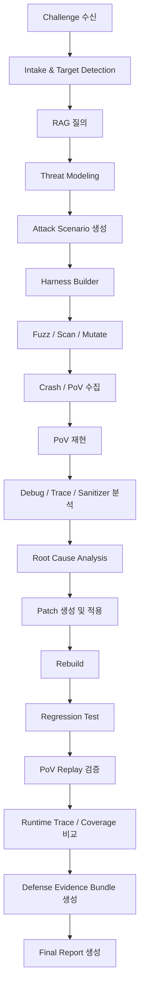

# Toolset 구현 지침 및 구현 순서

## 0. 결론

Toolset은 단순한 "fuzzer 목록"이 아니다. 본 프로젝트에서 Toolset은 에이전트가 챌린지를 받아 취약점과 공격 경로를 찾고, 패치를 생성하고, 패치 효과를 재현 가능한 증거로 검증하고, 최종 보고서까지 작성하기 위한 실행 계층이다.

따라서 구현 범위는 아래 3개 기능을 모두 포함해야 한다.

1. **Tool Registry**: 외부 도구의 종류, 컨테이너 이미지, 실행 명령, 입력/출력 스키마, 리소스 제한을 정의한다.
2. **Tool Executor**: 에이전트가 직접 shell을 만지지 않고 MCP 도구 호출로 빌드, fuzzing, debugging, tracing, testing을 실행하게 한다.
3. **Evidence Ledger**: 모든 실행 결과를 `trace_id`, command, exit code, 로그, artifact hash, timestamp와 함께 저장한다.

MVP는 모든 도구를 한 번에 구현하지 않는다. 먼저 C/C++ 챌린지 기준으로 `build -> fuzz -> crash reproduce -> debug/trace -> patch -> rebuild -> PoV replay -> regression test -> evidence export`가 닫히는 최소 경로를 구현한다.

## 0.1 작업 루트 고정

Toolset 관련 구현, 문서, 테스트, 스킬, MCP 서버, registry, schema, artifact 예시는 모두 repository root의 `Toolset/` 폴더 안에 둔다.

원칙:

- Toolset 작업 루트는 `C:\Users\SANE01\Documents\DAH\Toolset`이다.
- 구현 에이전트는 Toolset 관련 파일을 `Toolset/` 밖에 생성하거나 수정하지 않는다.
- `attack-rag/`는 RAG 전용 루트이므로 Toolset 구현 과정에서 수정하지 않는다. Toolset은 RAG를 직접 내장하지 않고 `attack_rag_query` 같은 외부 계약으로만 호출한다.
- `설계요구사항/`은 상위 설계 문서 참조용이다. Toolset 구현 중 해당 폴더의 파일은 읽기 전용으로 취급한다.
- 예외가 필요한 경우, 예외 파일 경로와 이유를 먼저 문서화하고 사용자 승인을 받은 뒤 진행한다.

## 1. 기존 설계 문서와의 관계

이 문서는 `SANITY_설계요구사항.md`와 `SANITY_아키텍쳐명세서.md`를 대체하지 않는다. 기존 문서의 Toolset 정의는 "도구 이미지/파라미터 스키마 레지스트리"에 가깝다. 구현 단계에서는 이를 아래처럼 확장한다.

| 기존 개념 | 구현 시 확장 |
|---|---|
| Toolset(8) | Registry + Executor + Evidence Collector |
| ToolDescriptor(DM-10) | 도구 메타데이터뿐 아니라 실행 계약, 출력 artifact 계약, 보안 정책 포함 |
| Defender 검증 | PoV replay뿐 아니라 build, test, sanitizer, trace, coverage, baseline comparison 포함 |
| Log(7) | 일반 이벤트 로그와 Toolset evidence ledger를 `trace_id`로 연결 |

## 2. 전체 처리 흐름



## 3. 구현 원칙

### 3.1 보안 경계

- Toolset은 허가된 챌린지 workspace에서만 실행한다.
- 외부 네트워크 접근은 기본 차단한다. REST/API 챌린지처럼 네트워크가 필요한 경우에도 loopback 또는 지정된 sandbox network만 허용한다.
- 에이전트에게 임의 shell 실행 권한을 주지 않는다. 모든 실행은 MCP 도구의 명시적 파라미터 스키마를 통과해야 한다.
- artifact 경로는 workspace 내부의 `artifacts/` 하위로 제한한다.
- command, env, working directory, timeout, resource limit, exit code는 반드시 evidence로 남긴다.
- secret, token, API key, credential은 로그에 저장하기 전에 마스킹한다.

### 3.2 구현 방식

- 외부 도구는 Python 코드로 재구현하지 않는다. CLI 또는 컨테이너 실행을 감싸는 adapter로 구현한다.
- 도구가 설치되어 있지 않으면 실패가 아니라 `availability: missing`으로 보고한다.
- 통합 테스트는 도구 설치 여부에 따라 skip 가능해야 한다. 단, registry/schema/unit test는 항상 통과해야 한다.
- 모든 tool call은 결정 가능한 JSON 입출력 계약을 가져야 한다.
- 공격 도구와 방어 검증 도구를 분리하지 말고, 동일한 `trace_id`와 artifact model 아래에서 연결한다.

## 4. 권장 디렉터리 구조

```text
Toolset/
  TOOLSET_구현지침.md
  README.md
  registry/
    tools.yaml
    profiles.yaml
  schemas/
    tool_descriptor.schema.json
    tool_result.schema.json
    artifacts.schema.json
    evidence_bundle.schema.json
  toolset_core/
    __init__.py
    registry.py
    executor.py
    workspace.py
    artifacts.py
    evidence.py
    policy.py
    adapters/
      __init__.py
      build.py
      test.py
      fuzz.py
      debug.py
      trace.py
      sanitizer.py
      coverage.py
      static_analysis.py
      patch.py
      report.py
  toolset_mcp/
    __init__.py
    server.py
    models.py
  skills/
    toolset-target-triage/SKILL.md
    harness-build-fuzz/SKILL.md
    pov-reproduce-debug/SKILL.md
    defense-patch-verify/SKILL.md
    evidence-report/SKILL.md
  tests/
    fixtures/
      c_buffer_overflow/
      c_safe_after_patch/
    test_registry.py
    test_executor_policy.py
    test_artifact_schema.py
    test_evidence_bundle.py
    test_mcp_contract.py
```

## 5. ToolDescriptor v1

`ToolDescriptor`는 registry의 핵심 계약이다. 최소 필드는 아래와 같다.

```yaml
tool_id: aflpp
display_name: AFL++
kind: fuzzer
phase:
  - attack_discovery
supported_target:
  - c
  - cxx
execution:
  mode: container
  image: ghcr.io/example/aflpp:stable
  entrypoint:
    - afl-fuzz
  command_template:
    - "-i"
    - "{seeds_dir}"
    - "-o"
    - "{output_dir}"
    - "--"
    - "{target_cmd}"
params_schema_ref: schemas/params/aflpp.schema.json
output_schema_ref: schemas/outputs/fuzz_job.schema.json
required_artifacts:
  - harness_ref
  - build_ref
produced_artifacts:
  - fuzz_job_ref
  - crash_ref
  - seed_corpus_ref
availability_probe:
  command:
    - afl-fuzz
    - "-V"
timeout_sec_default: 3600
resource_limits:
  cpu: 4
  memory_mb: 8192
  disk_mb: 20480
security_profile:
  network: disabled
  write_scope: workspace_artifacts_only
evidence_policy:
  capture_stdout: true
  capture_stderr: true
  capture_exit_code: true
  capture_artifact_hash: true
docs_url: https://aflplus.plus/docs/
```

### 5.1 kind enum

초기 enum은 아래로 둔다.

```text
builder
test_runner
fuzzer
debugger
tracer
sanitizer
coverage
static_analyzer
patcher
config_hardener
ids_rule_validator
reporter
```

## 6. 공통 Artifact 모델

모든 도구 결과는 `artifact_ref`로 참조한다. 파일 경로를 직접 다른 컴포넌트에 넘기지 않는다.

| Artifact | 필수 필드 |
|---|---|
| `ChallengeBundle` | `challenge_id`, `source_ref?`, `binary_ref?`, `apk_ref?`, `firmware_ref?`, `config_ref?` |
| `TargetProfile` | `language`, `build_system`, `runtime`, `entrypoints`, `test_commands`, `security_relevant_files` |
| `BuildArtifact` | `build_id`, `target_ref`, `build_profile`, `binary_refs`, `compile_commands_ref?`, `exit_code`, `log_ref` |
| `HarnessArtifact` | `harness_id`, `target_ref`, `entrypoint`, `input_format`, `harness_ref`, `build_ref?` |
| `FuzzJob` | `job_id`, `tool_id`, `harness_ref`, `seed_corpus_ref`, `started_at`, `ended_at`, `status` |
| `CrashReport` | `crash_id`, `job_id`, `input_blob_ref`, `signal?`, `exit_code`, `stacktrace_ref?`, `dedup_signature` |
| `PoV` | `pov_id`, `input_blob_ref`, `replay_command`, `pre_snapshot_ref`, `exploit_signature`, `crash_report_ref?` |
| `DebugTrace` | `trace_id`, `tool_id`, `pov_ref`, `stacktrace_ref`, `registers_ref?`, `locals_ref?`, `script_ref` |
| `RuntimeTrace` | `trace_id`, `tool_id`, `pov_ref`, `syscall_log_ref?`, `library_call_log_ref?`, `event_log_ref?` |
| `SanitizerReport` | `report_id`, `sanitizer`, `build_ref`, `pov_ref?`, `finding_ref`, `summary` |
| `CoverageReport` | `coverage_id`, `tool_id`, `build_ref`, `line_coverage?`, `branch_coverage?`, `report_ref` |
| `PatchArtifact` | `patch_id`, `base_ref`, `diff_ref`, `touched_files`, `rationale_ref`, `apply_result_ref` |
| `TestResult` | `test_result_id`, `tool_id`, `build_ref`, `passed`, `failed_tests`, `log_ref` |
| `DefenseEvidenceBundle` | `bundle_id`, `pov_ref`, `patch_ref`, `baseline_result_ref`, `patched_result_ref`, `test_result_refs`, `trace_refs`, `coverage_refs`, `verdict` |

## 7. MCP 도구 인터페이스

MCP 서버는 에이전트가 직접 사용할 최소 API만 노출한다. 내부 구현 세부사항은 숨긴다.

| MCP tool | 목적 | MVP |
|---|---|---|
| `toolset.list_tools` | registry 조회 | P0 |
| `toolset.probe_tool` | 도구 설치/컨테이너 availability 확인 | P0 |
| `toolset.detect_target` | 언어, 빌드 시스템, 실행 방식 식별 | P0 |
| `toolset.create_workspace` | challenge workspace와 artifact root 생성 | P0 |
| `toolset.build` | 일반 build 또는 sanitizer build 수행 | P0 |
| `toolset.run_tests` | unit/integration/regression test 실행 | P0 |
| `toolset.build_harness` | fuzz harness 생성 또는 등록 | P0 |
| `toolset.start_fuzz` | fuzzing job 시작 | P0 |
| `toolset.collect_findings` | crash, seed, coverage, static finding 수집 | P0 |
| `toolset.reproduce_pov` | pre-patch 또는 patched build에서 PoV 재현 | P0 |
| `toolset.debug_gdb` | GDB batch script로 stacktrace/registers 수집 | P0 |
| `toolset.trace_runtime` | strace/ltrace/perf/bpftrace/OpenTelemetry 실행 | P0/P1 |
| `toolset.run_sanitizer` | ASan/UBSan/MSan/TSan/Valgrind 결과 수집 | P0/P1 |
| `toolset.measure_coverage` | gcov/llvm-cov/lcov/gcovr/JaCoCo/coverage.py 실행 | P0/P1 |
| `toolset.static_scan` | CodeQL/Semgrep/clang-tidy/cppcheck/Bandit/SpotBugs 실행 | P1 |
| `toolset.apply_patch` | unified diff 적용 | P0 |
| `toolset.compare_baseline` | baseline vs patched 실행 결과 비교 | P0 |
| `toolset.export_evidence` | DefenseEvidenceBundle 생성 | P0 |
| `toolset.generate_report` | 최종 보고서 초안 생성 | P1 |

### 7.1 공통 MCP 응답 형식

```json
{
  "ok": true,
  "trace_id": "string",
  "tool_id": "string",
  "status": "success|failure|timeout|missing|skipped",
  "artifact_refs": ["string"],
  "summary": "short human-readable summary",
  "diagnostics": {
    "exit_code": 0,
    "duration_ms": 1234,
    "stdout_ref": "artifact://...",
    "stderr_ref": "artifact://..."
  }
}
```

실패 응답도 같은 형식을 유지한다. 예외 stacktrace를 agent에게 그대로 노출하지 말고 `diagnostics.error_type`, `diagnostics.error_message`, `log_ref`로 구조화한다.

## 8. 구현 우선순위

### P0: MVP 필수 경로

목표: C/C++ 로컬 챌린지 하나에 대해 취약점 발견부터 패치 검증까지 닫힌 루프를 만든다.

구현 대상:

- Registry/schema
- Workspace/artifact/evidence 저장소
- Build adapter: `cmake`, `make`, `ninja`
- Test adapter: `ctest`, `pytest`
- Fuzz adapter: `AFL++`, `libFuzzer`
- Debug adapter: `GDB`, `gdbserver`
- Trace adapter: `strace`
- Sanitizer adapter: `AddressSanitizer`, `UndefinedBehaviorSanitizer`
- Coverage adapter: `gcov`, `llvm-cov`
- Patch adapter: unified diff apply
- Baseline comparison
- Evidence export

P0 통과 기준:

- `toolset.list_tools`가 P0 도구를 반환한다.
- `toolset.probe_tool`이 설치됨/없음을 구조화해서 반환한다.
- toy vulnerable C target에서 pre-patch PoV가 crash를 재현한다.
- 동일 PoV가 patched build에서 crash를 재현하지 않는다.
- patch 후 unit/regression test가 통과한다.
- evidence bundle에 build log, crash log, GDB stacktrace, strace log, sanitizer report, coverage report, patch diff가 포함된다.

### P1: 실전 범위 확장

목표: Android, protocol, REST API, Java/Python 프로젝트까지 확장한다.

구현 대상:

- Android adapter: `AFL-Android`, `adb`, `logcat`, `gdbserver` 또는 `lldb-server`
- Additional fuzzers: `honggfuzz`, `boofuzz`, `RESTler`
- Debug adapter: `LLDB`, `rr`
- Runtime audit: `ltrace`, `perf`
- Sanitizer/Memory: `MemorySanitizer`, `ThreadSanitizer`, `Valgrind Memcheck`
- Coverage: `lcov`, `gcovr`, `JaCoCo`, `coverage.py`
- Static analysis: `CodeQL`, `Semgrep`, `clang-tidy`, `cppcheck`, `Bandit`, `SpotBugs`
- Report generator

P1 통과 기준:

- target kind에 따라 tool selection이 달라진다.
- Android APK 또는 NDK target에서 최소 build/run/probe가 동작한다.
- REST API target에서 RESTler 또는 fallback HTTP test harness가 동작한다.
- static scan 결과가 evidence bundle에 포함된다.

### P2: 고급 시스템/운영 검증

목표: kernel, eBPF, observability, 방어 규칙 검증까지 확장한다.

구현 대상:

- `syzkaller`
- `bpftrace`
- OpenTelemetry trace 수집
- IDS/IPS rule validator
- Config hardener
- 성능 회귀 측정

P2 통과 기준:

- kernel/syscall target은 일반 fuzzer가 아니라 syzkaller 계열로 라우팅된다.
- runtime trace와 application trace가 같은 `trace_id`로 묶인다.
- 방어 규칙은 샘플 positive/negative traffic으로 검증된다.

### P3: 연구형 자동화

목표: LLM 기반 seed 생성, mutator, deep generator를 붙인다.

구현 대상:

- LLM-Augmented Mutator
- Deep Generator Agent
- Deep Generator Engine
- Custom format inference
- Corpus selector/ensembler

P3 통과 기준:

- LLM이 생성한 seed가 기존 seed 대비 coverage 또는 crash discovery에 기여했는지 측정된다.
- 기여가 없으면 자동으로 비활성화된다.

## 9. 대상 유형별 tool selection 정책

| Target kind | 1차 도구 | 보조 도구 | 비고 |
|---|---|---|---|
| C/C++ source | CMake/make/ninja, AFL++, libFuzzer, ASan/UBSan, GDB, strace, gcov/llvm-cov | Valgrind, rr, clang-tidy, cppcheck, CodeQL | MVP 기준 |
| Binary-only | GDB, strace, ltrace, Valgrind, AFL++ QEMU mode 가능 여부 probe | rr, perf | source patch 불가 시 config hardening 또는 report 중심 |
| Android APK/NDK | AFL-Android, adb, logcat, gdbserver/lldb-server, Gradle | ASan for Android, Frida는 별도 승인 시만 | 에뮬레이터/디바이스 profile 필요 |
| REST API | RESTler, pytest, coverage.py | Semgrep, Bandit | network scope를 loopback으로 제한 |
| Protocol daemon | boofuzz, AFL++ persistent mode 가능성 검토 | strace, ASan, GDB | stateful protocol은 seed/session 관리 필요 |
| Kernel/syscall | syzkaller | GDB, ftrace/perf/bpftrace | 격리 VM 필요 |
| Java | Maven/Gradle, JUnit, JaCoCo, SpotBugs, Semgrep | CodeQL | patch 검증은 test와 coverage 중심 |
| Python | pytest, coverage.py, Bandit, Semgrep | CodeQL | fuzzing보다 property/input test 우선 |

## 10. 에이전트 Skill 구성

Skill은 "언제 어떤 MCP tool을 어떤 순서로 호출할지"를 고정하는 실행 절차서다.

### 10.1 `toolset-target-triage`

목적:

- 챌린지의 언어, 빌드 시스템, 실행 방식, 공격면을 식별한다.

필수 절차:

1. `toolset.create_workspace`
2. `toolset.detect_target`
3. `attack_rag_query`로 유사 CWE/CVE/ATT&CK/CAPEC 검색
4. `toolset.list_tools`로 target kind에 맞는 도구 후보 조회
5. `toolset.probe_tool`로 사용 가능한 도구만 남김

출력:

- `TargetProfile`
- `ToolPlan`

### 10.2 `harness-build-fuzz`

목적:

- target을 빌드하고 harness를 생성한 뒤 fuzzing job을 실행한다.

필수 절차:

1. `toolset.build`
2. `toolset.build_harness`
3. `toolset.start_fuzz`
4. `toolset.collect_findings`
5. crash가 있으면 `toolset.reproduce_pov`

출력:

- `BuildArtifact`
- `HarnessArtifact`
- `FuzzJob`
- `CrashReport`
- `PoV`

### 10.3 `pov-reproduce-debug`

목적:

- 성공한 PoV를 재현하고 root cause 분석에 필요한 증거를 수집한다.

필수 절차:

1. `toolset.reproduce_pov` on baseline build
2. `toolset.debug_gdb`
3. `toolset.trace_runtime`
4. `toolset.run_sanitizer`
5. `toolset.measure_coverage`

출력:

- `DebugTrace`
- `RuntimeTrace`
- `SanitizerReport`
- `CoverageReport`
- root cause 후보

### 10.4 `defense-patch-verify`

목적:

- 패치를 적용하고 방어 효과를 검증한다.

필수 절차:

1. patch 생성 또는 수신
2. `toolset.apply_patch`
3. `toolset.build` on patched workspace
4. `toolset.run_tests`
5. `toolset.reproduce_pov` on patched build
6. `toolset.run_sanitizer`
7. `toolset.trace_runtime`
8. `toolset.measure_coverage`
9. `toolset.compare_baseline`

방어 성공 조건:

```text
patched_build_success
AND regression_tests_pass
AND baseline_pov_reproduces
AND patched_pov_blocked
AND no_new_sanitizer_finding_on_replay
AND evidence_bundle_complete
```

### 10.5 `evidence-report`

목적:

- 최종 제출 가능한 보고서와 증거 묶음을 만든다.

필수 절차:

1. `toolset.export_evidence`
2. `toolset.generate_report`
3. report 내부의 artifact hash와 evidence ledger의 hash 일치 확인

출력:

- `DefenseEvidenceBundle`
- final report markdown/pdf
- patch diff
- PoV 재현 자료

## 11. Defense Verification Gates

패치 성공은 아래 gate를 모두 통과해야 한다.

| Gate | 이름 | 통과 조건 | 실패 시 조치 |
|---|---|---|---|
| G1 | Patch Apply | unified diff가 clean apply | patch 재생성 |
| G2 | Build | patched target build exit code 0 | build log 기반 수정 |
| G3 | Regression Test | 기존 test 통과 | 기능 회귀 분석 |
| G4 | Sanitizer/Memory | PoV replay와 smoke test에서 신규 finding 없음 | root cause 재분석 |
| G5 | PoV Replay | baseline은 실패/crash, patched는 비crash 또는 exploit blocked | patch 불충분 |
| G6 | Runtime Trace | 취약 syscall/API 경로가 제거 또는 guarded | trace diff 확인 |
| G7 | Coverage | 취약 경로 또는 관련 함수가 테스트/재현에서 관측됨 | harness/test 보강 |
| G8 | Evidence | 로그, hash, 명령, exit code, artifact가 누락 없음 | evidence 재수집 |

## 12. Evidence Ledger 형식

모든 tool invocation은 append-only JSONL로 기록한다.

```json
{
  "trace_id": "challenge-node-agent-run",
  "event_type": "tool_invocation",
  "tool_id": "gdb",
  "phase": "debug",
  "workspace_id": "string",
  "command": ["gdb", "--batch", "-x", "script.gdb", "./target"],
  "cwd": "artifact://workspace/root",
  "env_redacted": {"ASAN_OPTIONS": "redacted-or-value"},
  "started_at": "ISO-8601",
  "ended_at": "ISO-8601",
  "duration_ms": 1234,
  "exit_code": 0,
  "stdout_ref": "artifact://logs/stdout.txt",
  "stderr_ref": "artifact://logs/stderr.txt",
  "produced_artifacts": ["artifact://debug/stacktrace.txt"],
  "artifact_hashes": {
    "artifact://debug/stacktrace.txt": "sha256:..."
  }
}
```

## 13. 구현 순서

### Step 1. 계약부터 고정

구현 파일:

- `Toolset/schemas/tool_descriptor.schema.json`
- `Toolset/schemas/tool_result.schema.json`
- `Toolset/schemas/artifacts.schema.json`
- `Toolset/schemas/evidence_bundle.schema.json`
- `Toolset/registry/tools.yaml`

완료 조건:

- schema validation unit test 통과
- P0 도구가 registry에 등록됨
- 잘못된 descriptor가 test에서 거부됨

### Step 2. Workspace와 Artifact Store 구현

구현 파일:

- `Toolset/toolset_core/workspace.py`
- `Toolset/toolset_core/artifacts.py`
- `Toolset/toolset_core/evidence.py`

완료 조건:

- workspace 밖 경로 쓰기 차단
- artifact 저장 시 sha256 자동 계산
- evidence JSONL append 동작

### Step 3. Executor와 Policy 구현

구현 파일:

- `Toolset/toolset_core/executor.py`
- `Toolset/toolset_core/policy.py`

완료 조건:

- timeout, working directory, env allowlist, output capture 동작
- missing command를 구조화된 `status: missing`으로 반환
- command injection 위험이 있는 string command 금지. argv list만 허용

### Step 4. P0 Build/Test adapter 구현

구현 파일:

- `Toolset/toolset_core/adapters/build.py`
- `Toolset/toolset_core/adapters/test.py`

완료 조건:

- CMake/make/ninja build 지원
- CTest/pytest 실행 지원
- build/test log가 artifact로 저장됨

### Step 5. P0 Fuzz adapter 구현

구현 파일:

- `Toolset/toolset_core/adapters/fuzz.py`

완료 조건:

- AFL++ 실행 adapter
- libFuzzer 실행 adapter
- crash corpus와 seed corpus 수집
- fuzz budget은 time/sec와 exec count 둘 다 지원

### Step 6. PoV 재현 구현

구현 파일:

- `Toolset/toolset_core/adapters/replay.py`

완료 조건:

- input_blob_ref 기반 replay
- baseline build에서 crash 재현 여부 판정
- patched build에서 blocked 여부 판정

### Step 7. Debug/Trace/Sanitizer/Coverage 구현

구현 파일:

- `Toolset/toolset_core/adapters/debug.py`
- `Toolset/toolset_core/adapters/trace.py`
- `Toolset/toolset_core/adapters/sanitizer.py`
- `Toolset/toolset_core/adapters/coverage.py`

완료 조건:

- GDB batch stacktrace 수집
- strace log 수집
- ASan/UBSan 결과 수집
- gcov/llvm-cov report 수집

### Step 8. Patch와 Baseline Comparison 구현

구현 파일:

- `Toolset/toolset_core/adapters/patch.py`
- `Toolset/toolset_core/adapters/compare.py`

완료 조건:

- unified diff apply
- baseline vs patched 결과 비교
- 방어 성공 조건 자동 판정

### Step 9. MCP Server 구현

구현 파일:

- `Toolset/toolset_mcp/server.py`
- `Toolset/toolset_mcp/models.py`

완료 조건:

- 7장의 MCP tool 전부 노출
- 모든 tool 응답이 공통 응답 형식 준수
- 실패 케이스도 JSON으로 반환

### Step 10. Skill 작성

구현 파일:

- `Toolset/skills/*/SKILL.md`

완료 조건:

- 각 Skill이 trigger, input, MCP call sequence, output, failure handling을 포함
- agent가 임의 shell 대신 MCP tool을 호출하도록 명시

### Step 11. P1/P2 도구 확장

P0 경로가 안정화된 뒤에만 구현한다.

구현 순서:

1. LLDB, rr, Valgrind
2. honggfuzz, boofuzz, RESTler
3. lcov/gcovr, JaCoCo, coverage.py
4. CodeQL, Semgrep, clang-tidy, cppcheck, Bandit, SpotBugs
5. AFL-Android, adb/logcat/gdbserver profile
6. syzkaller
7. bpftrace, OpenTelemetry
8. config hardener, IDS/IPS rule validator

## 14. 테스트 전략

### 14.1 Unit Test

- registry schema validation
- artifact path normalization
- workspace escape 차단
- evidence ledger append
- executor timeout
- missing tool handling
- common MCP response shape

### 14.2 Integration Test

환경변수 `TOOLSET_INTEGRATION=1`일 때만 실제 외부 도구를 호출한다.

필수 시나리오:

1. toy C target build
2. sanitizer build
3. PoV replay로 crash 재현
4. GDB stacktrace 수집
5. strace log 수집
6. patch apply
7. patched build
8. patched PoV blocked
9. regression test pass
10. evidence bundle export

### 14.3 Golden Test

`Toolset/tests/fixtures/c_buffer_overflow/`에 의도적으로 취약한 toy target을 둔다. 이 fixture는 외부 시스템 공격이 아니라 Toolset 검증용 로컬 테스트다.

Golden test 통과 조건:

- pre-patch에서 PoV가 crash 또는 sanitizer finding을 만든다.
- patch 적용 후 동일 PoV가 crash를 만들지 않는다.
- patch 후 정상 입력 test가 통과한다.
- evidence bundle verdict가 `defense_verified`다.

## 15. 최종 보고서 구성

최종 보고서는 아래 항목을 포함해야 한다.

1. Challenge 개요
2. TargetProfile
3. Threat model 요약
4. 공격 시나리오와 공격 경로
5. 사용한 Toolset과 선택 근거
6. 발견 취약점
7. PoV 재현 절차
8. Root cause 분석
9. Patch diff와 방어 전략
10. Defense Verification Gates 결과
11. Baseline vs Patched 비교표
12. 잔여 위험
13. Evidence artifact 목록과 sha256

## 16. 도구별 공식 문서 확인 위치

구현자는 각 adapter 구현 전에 공식 문서를 확인해야 한다. 아래 URL은 시작점이다.

| 도구 | 공식 문서 |
|---|---|
| AFL++ | https://aflplus.plus/docs/ |
| libFuzzer | https://llvm.org/docs/LibFuzzer.html |
| GDB | https://sourceware.org/gdb/current/onlinedocs/gdb.html/ |
| LLDB | https://lldb.llvm.org/use/tutorial.html |
| rr | https://rr-project.org/ |
| strace | https://man7.org/linux/man-pages/man1/strace.1.html |
| Valgrind Memcheck | https://valgrind.org/docs/manual/mc-manual.html |
| Clang Sanitizers | https://clang.llvm.org/docs/ |
| CMake/CTest | https://cmake.org/cmake/help/latest/manual/ctest.1.html |
| GCC gcov | https://gcc.gnu.org/onlinedocs/gcc/Gcov.html |
| LLVM coverage | https://clang.llvm.org/docs/SourceBasedCodeCoverage.html |
| CodeQL | https://codeql.github.com/docs/ |
| Semgrep | https://semgrep.dev/docs/ |
| syzkaller | https://github.com/google/syzkaller/tree/master/docs |
| bpftrace | https://bpftrace.org/docs/ |
| OpenTelemetry | https://opentelemetry.io/docs/concepts/signals/traces/ |

## 17. 구현 금지사항

- agent에게 raw shell tool을 그대로 노출하지 말 것.
- 외부 네트워크 target을 기본 허용하지 말 것.
- fuzzing 결과만으로 취약점 성공을 선언하지 말 것.
- patch 후 build/test 없이 성공 처리하지 말 것.
- patched PoV blocked만 보고 기능 회귀가 없다고 판단하지 말 것.
- artifact hash 없는 보고서를 생성하지 말 것.
- 도구가 없을 때 조용히 fallback하지 말 것. 반드시 `missing`으로 기록할 것.

## 18. Definition of Done

P0 완료 판정:

- `toolset.list_tools`, `toolset.probe_tool`, `toolset.detect_target`, `toolset.build`, `toolset.run_tests`, `toolset.start_fuzz`, `toolset.reproduce_pov`, `toolset.debug_gdb`, `toolset.trace_runtime`, `toolset.run_sanitizer`, `toolset.measure_coverage`, `toolset.apply_patch`, `toolset.compare_baseline`, `toolset.export_evidence`가 동작한다.
- toy vulnerable target 기준으로 end-to-end golden test가 통과한다.
- 모든 실행 결과가 evidence ledger에 남는다.
- 최종 report가 evidence bundle의 artifact hash와 일치한다.
- 기존 `SANITY_설계요구사항.md`의 Defender/Toolset 요구사항을 깨지 않는다.
- Toolset 관련 산출물이 `Toolset/` 밖에 생성되지 않는다.

P1 이후 완료 판정:

- Android, REST API, protocol, Java/Python 중 최소 2개 target kind에 대해 tool selection과 검증 루프가 동작한다.
- static analysis 결과와 runtime evidence가 같은 `trace_id`로 연결된다.
- agent가 도구를 취사선택할 때 실패한 도구, 누락된 도구, skip한 도구의 이유를 모두 보고한다.
